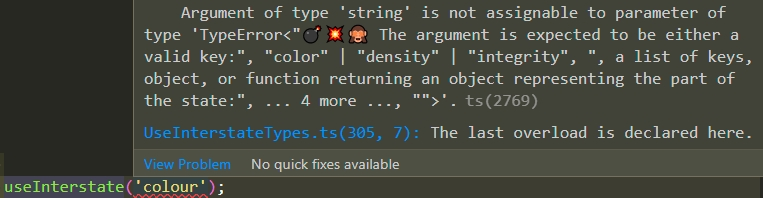
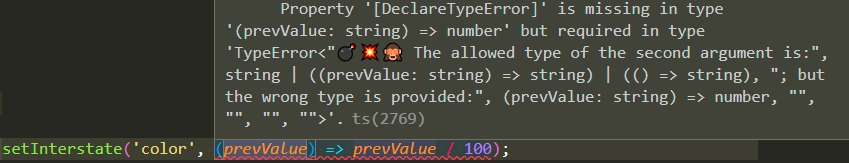

# *use-interstate* and *TypeScript*

The true strength of the library comes from the use of *TypeScript*. When the default state is provided
trough `initInterstate` all emitted methods become aware of the shape of the state. It comes either
from the inference from the default state or the explicitly defined generic value:

```ts
/**
 * The shape of the state inferred from the type of the value passed to `initInterstate`
 */
const { useInterstate, readInterstate, setInterstate, resetInterstate } = initInterstate({
  color: 'red',
  density: 100,
  integrity: true,
});

/* OR... */

interface State {
  color: string;
  density: number;
  integrity: boolean;
}

/**
 * Explicitly specify the shape of the state
 */
const { useInterstate, readInterstate, setInterstate, resetInterstate } = initInterstate<State>();
```

Later on, this familiarity with the state helps to infer values of the state and prevents from
misuse of the methods:

```ts
const density = readInterstate('density');

/**
 * `density` is inferred to be a number
 */
const densityRatio = density / 100;

/**
 * `prevValue` is inferred to be a string, so it is an error to divide by 100
 */
setInterstate('color', (prevValue) => prevValue / 100);
```

## Error messages

One of the most confusing things about TypeScript is the way how it notifies about errors. Sometimes
it takes a lot of effort to understand what exactly it complains of. *use-interstate* provides an
innovative way to tell about what is wrong. All that is needed are to find conspicuous symbols
"💣💥🙈" among the lines of the error message and read a clear explanation.



Another example:



## Dev types

Each method such as `initInterstate`, `useInterstate`, `readInterstate`, etc. is of a type having
the same name (`InitInterstate`,  `UseInterstate` etc.). In some cases, it is not practical to use
them explicitly because their primary goal is to define the behavior suggesting a safe way to use
them. For developers who aim to use the *use-interstate* library for writing their libraries or
*React* components with nontrivial logic, there are [type aliases](../src/DevTypes.ts) with "Dev"
ending in their names (`InitInterstateDev`,  `UseInterstateDev` etc.) They also explain better the
logic of the methods that could substitute reading the documentation for those who are experienced
in TypeScript. The original types and their *dev*-aliases are compatible in the way that
`UseInterstate`, for example, extends `UseInterstateDev`:

```ts
const useInterstateDev: UseInterstateDev<State> = useInterstate as UseInterstate<State>;
```
